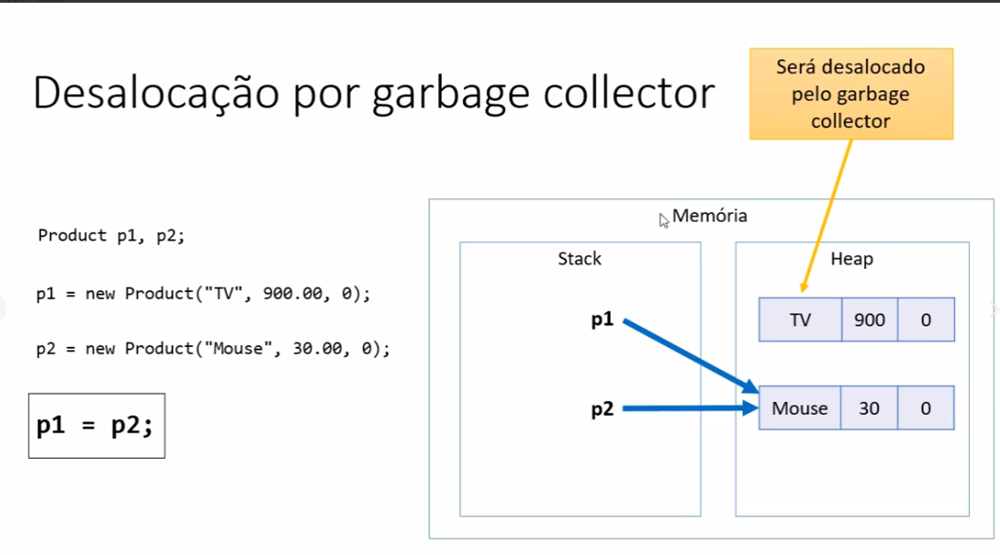
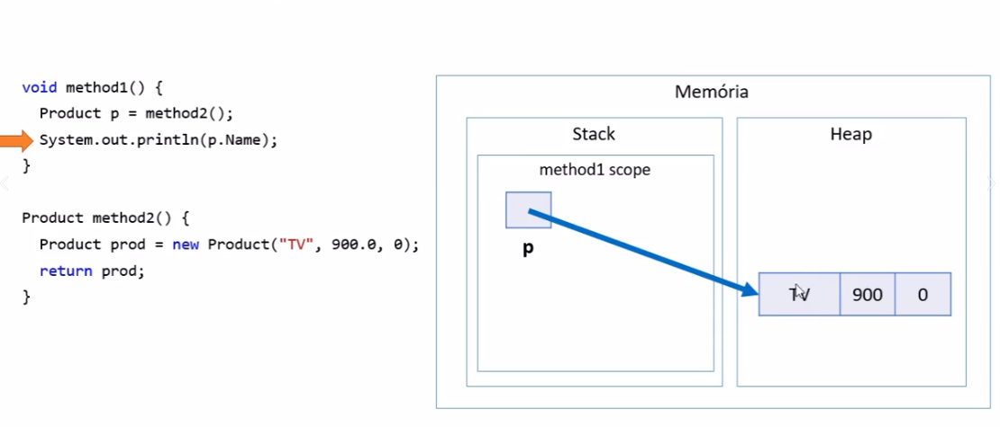

# Garbage collector 

-> É um processo que automatiza o gerenciamento de memória de um programa em execução 

-> O garbage collector monitora os objetos alocados dinamicamente pelo programa (no heap),
desalocando aqueles que não estão mais sendo utilizados.

-> Objetos que estão sem referencia serão desalocados pelo garbage collector, liberando a memoria. 

## Desalocação por escopo 

## Resumo 

-> Objetos alocados dinamicamente, quando não possuem mais referência para eles, 
serão desalocados pelo garbage collector

-> Variáveis locais são desalocadas imediatamente assim que seu escopo 
local sai de execução