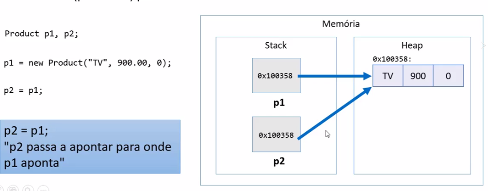
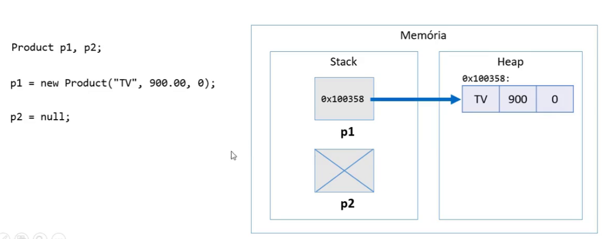
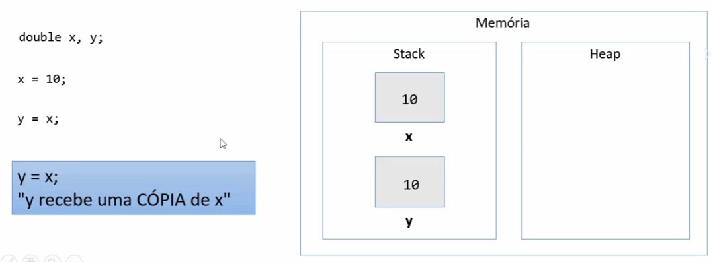
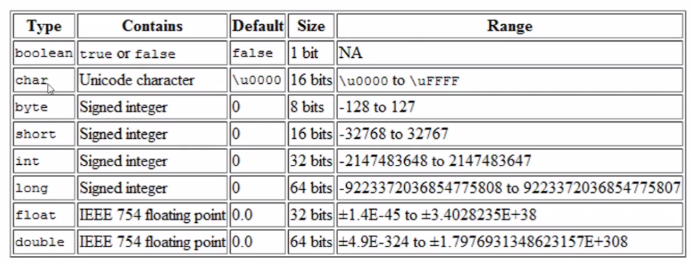
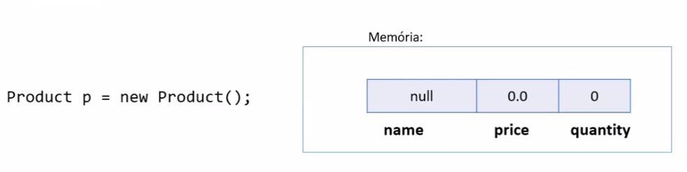
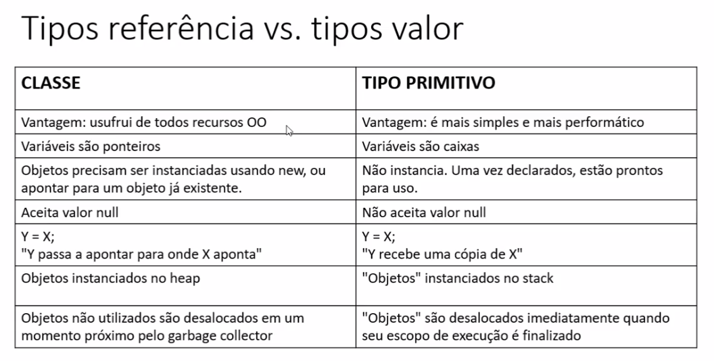

# Tipo referência vs. tipos valor

## Classes são tipos referência 

Variáveis cujo tipo são classes não devem ser entendidas como caixas, mas sim "tentáculos" (ponteiros) para caixas

## Valor "null"

Tipos referência aceitam o valor "null", que indica que a variável aponta para ninguém.

## Tipoos primitivos são tipos valor 

Em java, tipos primitivos são tipos valor. Tipos valor são caixas e não ponteiros. 

## Valores padrão

-> Quando alocamos (new) qualquer tipo estruturado (classe ou array), são atribuídos valores padrão aos seus elementos.
    -> Números: 0
    -> boolean: false
    -> char: caractere código 0
    -> objeto: null

